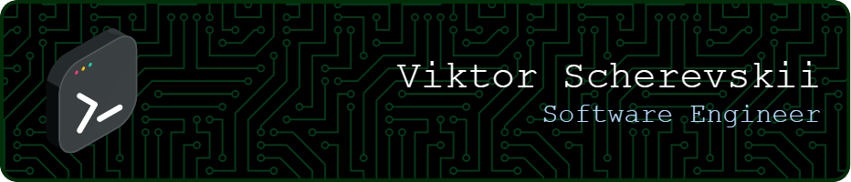
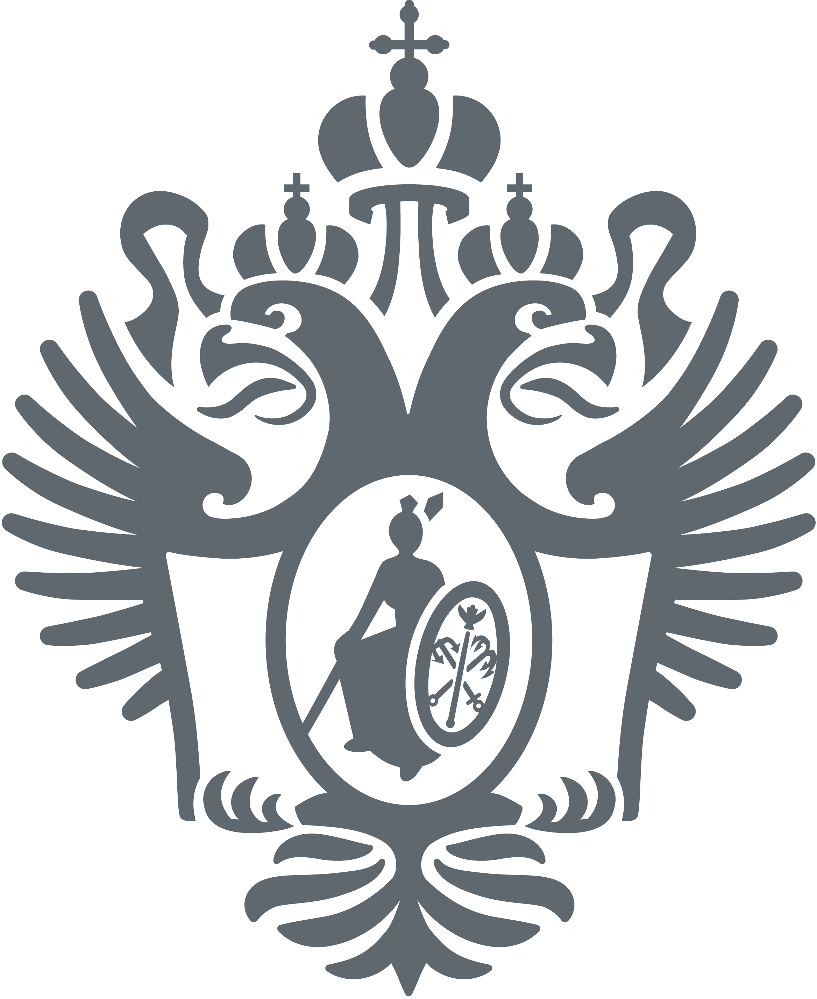

  

## 👨‍💻 About Me

I’m Viktor. I write code, explore new tech, and try to make each project better than the last.

## ⚒️ Tech Stack

<table>
  <tr>
    <td><strong>Languages &amp; Platforms</strong></td>
    <td>
      
      
      
      
      
      
      
      
      
    </td>
  </tr>
  <tr>
    <td><strong>Frameworks &amp; Libraries</strong></td>
    <td>
      <ins>Backend:</ins>&nbsp;&nbsp;
            
            
            
            
            
       
      <ins>Frontend:</ins>&nbsp;
            
            
            
    </td>
  </tr>
  <tr>
    <td><strong>Data &amp; Messaging</strong></td>
    <td>
      
      
      
      
      
    </td>
  </tr>
  <tr>
    <td><strong>DevOps</strong></td>
    <td>
      
      
      
      
      
    </td>
  </tr>
  <tr>
    <td><strong>Tools &amp; Technologies</strong></td>
    <td>
      
      
      
      
      
      
      
      
      
      
      
    </td>
  </tr>
</table>

## 🎓 Education

<table>
  <tr>
    <td width="60">
      
    </td>
    <td>
      <b>Master’s Degree, Software Engineering</b> 
      Saint Petersburg State University (2023–2025)
    </td>
  </tr>
  <tr>
    <td width="60">
      
    </td>
    <td>
      <b>Bachelor’s Degree, Programming and Information Technology</b> 
      Saint Petersburg State University (2019–2023)
    </td>
  </tr>
</table>

## 📊 GitHub Stats

  
  

## 📫 Contact

